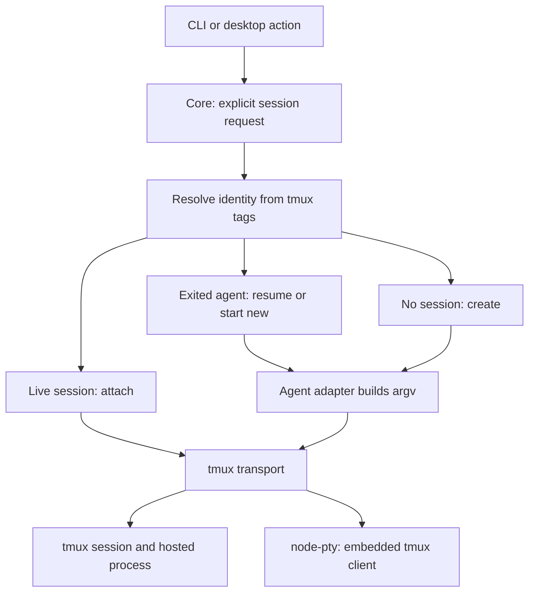

# Design decisions

Read the section relevant to the change. Area `AGENTS.md` files contain the
working rules; this document explains constraints that are easy to miss.

## Shared operations and entry points

Core owns sequences of git, filesystem, PTY, config and provider calls.
App-core supplies React bindings; shells own presentation. The desktop renderer
cannot use Node APIs and accesses core's plan through `@n10/core/plan`.
Keep that entry browser-safe and the core/app-core barrels separate.

When changing shared behavior, compare both shells. Worktree removal is
implemented in the TUI's `performDelete` and desktop's `services/worktrees.ts`;
both use core's removal sequence to stop persisted tmux sessions. Draft posting uses one comment per `postReviewComments` call,
so a partial failure cannot reset already-posted comments to drafts.

A fresh worktree needs its own `npm ci`: workspace links and nested dependencies
must resolve to that checkout. Copying only another checkout's root
`node_modules` misses per-workspace dependencies. Typecheck before code edits.
Nx targets may be inline in package manifests or inferred by plugins; inspect
resolved configuration with `npx nx show project <name> --json`.

## Tmux sessions and transport

n10 requires tmux 3.2 or newer. Startup probes it and reports an installation
hint when unavailable; a stored `terminalBackend` field has no effect. Every
worktree agent and terminal tab runs in tmux. `node-pty` remains the low-level
connection used to embed a tmux client in the CLI or desktop terminal.

Core owns identity and agent policy. `session/open-session.ts` receives an
explicit worktree or terminal request, resolves tagged sessions, and chooses a
create, attach or restart plan. It validates a worktree's HEAD before touching
an existing connection. Only create/restart calls the agent command builder.
`terminal-tmux` executes that plan, allocates collision-free names, carries
opaque tags and observes native pane state; it knows no repositories or agents.
The registry owns local terminal rendering and activity. Launch preparation is
asynchronous; callers await registration before installing relays or focusing
terminals. Concurrent requests for one identity share preparation.

Desktop creation runs `prepareTmuxSession` in an Electron utility process.
Spawning a persistent tmux server directly from Electron on Linux leaks Chromium
file descriptors into it, including profile locks. The supported utility-process
boundary isolates those resources; attach and restart can run locally against
an existing server. Build and development entry points include the worker.

Creation uses a detached placeholder while tags and `remain-on-exit` are set,
then replaces only that placeholder with the agent or shell. Restart refuses a
live pane: `respawn-pane` without `-k` and subsequent metadata writes share one
server command queue, so a losing concurrent restart cannot overwrite the
winner's agent tag. Attaching never builds argv or rewrites identity tags.

Tmux retains its server environment. Each launch explicitly supplies HOME,
PATH and the agent adapter's environment additions; do not copy the entire
process environment into command-line `-e` flags. `list-sessions -F` output is
tab-separated; `tmux -u` preserves separators under non-UTF-8 locales.

Tests isolate HOME and the tmux socket, unset inherited TMUX, and validate that
the socket belongs to the fixture before cleanup. Kill fixture sessions
individually; never use `tmux kill-server` or the user's default server.

macOS and Linux are the supported platforms. Every launch goes through tmux,
which has no native Windows build, so there is no native Windows path; the old
`cmd.exe` branches in the agent registry (`shellInvoke`, `shellEnvRef`) and
their `/bin/sh`-does-not-exist-on-Windows rationale predate the tmux-only
launcher and are gone. WSL is untested and secondary — its tmux runs under
Linux, so it may work, but nothing here specifically supports it.

## Session identity shared with Orchestra

Names are labels; tags carry identity. n10 and the Orchestra skill's bash
scripts create ordinary tmux sessions using the same user options:

| Session user option       | Meaning                                  |
| ------------------------- | ---------------------------------------- |
| `@orchestra-spawner`      | Creator, such as `n10` or `orchestra`    |
| `@orchestra-repo`         | Canonical main checkout path             |
| `@orchestra-session-type` | `worktree`, `shell` or `agent`           |
| `@orchestra-branch`       | Exact branch for a worktree session      |
| `@orchestra-agent`        | Agent used for the most recent launch    |
| `@orchestra-review`       | Pull request a background review reviews |

The shared names live in `session-identity.ts`. Creator/reporting metadata
survives attachment and restart; a successful new process updates its agent
metadata. Tags contain data, never arbitrary commands to execute. They live
only as long as the tmux session, and do not provide persistence after reboot.

Worktree lookup matches canonical repository plus exact branch. A terminal
lookup uses its actual allocated tmux target. `session-resolver.ts` obtains one
listing and applies those rules for attach, discovery, liveness and cleanup.
A session lacking a spawner or recognized type is foreign; worktree sessions
also require a repo tag. A familiar name alone never authorizes attachment or
termination. Duplicate worktree identities resolve to the oldest session;
extras are listed, never silently killed.

Labels are `<repo>-<branch>`, `<repo>-shell`, `<repo>-agent` or
`<repo>-<branch>-review`. The repo is the
canonical main checkout's basename; `/`, `.` and `:` become `-`. A label longer
than 200 characters keeps its first 195 plus a four-digit hash suffix. Name
collisions add `-2`, `-3`, and so on, always from the original preferred label.
A duplicate-name race retries allocation without adopting the other session.
Core registry keys are JSON tuples: `["worktree", repo, exactBranch]` or
`["terminal", actualTmuxName]`. Display labels never address registry entries.

## Launch environment and the machine it runs on

A session's environment is `process.env` plus an `additions` map, and only the
second half describes the launch rather than the orchestrating process.
`session/machine-env.ts` is the one place that fills it, and it is handed
capabilities rather than paths: a caller asks for "the work Claude
configuration" or "an index of your own" and the answer is computed where the
agent will run.

Claude configuration directories are registered per machine and stored as
tokens: a directory under `HOME` is kept as `~/.claude-work`, and one outside it
stays absolute and names that machine only (`agents/agent-config-dirs.ts`). The
default entry is `~/.claude`, which is also what an unconfigured machine has.
An unselected directory contributes no `CLAUDE_CONFIG_DIR` at all, so whatever
the host already has stays in force — a launch that inherits nothing is a
launch that lands in the host's own default, which is the correct answer rather
than a gap.

**The selection is local-only, by design.** A remote machine has its own home,
its own credentials and its own registered directories; it is sent no
`CLAUDE_CONFIG_DIR` and uses its own default. Forwarding this host's answer is
the bug, so the gate lives in `machineEnvAdditions` rather than in each caller.
The directory list is desktop-configured and deliberately absent from the shared
settings catalog in `settings/fields.ts`.

## Concurrent agents in one worktree

A background review reads a checkout another agent may be writing. Two things
keep that from being a collision rather than merely being asked not to be:

- `GIT_OPTIONAL_LOCKS=0` stops git taking the locks that `git status` and
  `git diff` need to refresh the index's stat cache. Without it a review that
  only ever looks at the diff still writes `.git/index` and contends with the
  working agent.
- `GIT_INDEX_FILE` points at a copy of the worktree's index taken at launch, so
  anything that does write an index writes that one. The copy is why the index
  is a copy and not an empty file: an empty index reads every tracked file as
  newly added. When it cannot be copied the variable is left unset and only the
  lock suppression applies.

Everything else is instruction, not enforcement, and the difference matters.
Claude is additionally given `--allowedTools` (`BACKGROUND_REVIEW_TOOLS` in
`session/review-prompt.ts`), which is a real ceiling: read and search tools, the
read-only git subcommands, and `n10 util add-comment` — no write tool and no
index-writing git command. Agents that cannot be given a tool allowlist get the
same rules as prompt text and nothing more.

The review reads a tree that is being changed under it. That is accepted rather
than prevented: the point of running the two at once is reviewing work as it
happens, and the alternative — a second checkout — would review something the
branch no longer is. The prompt says so, so the agent reports what it saw
instead of trying to hold the tree still.

## Background reviews

A launched review runs in its own tmux session against the worktree, so starting
one no longer displaces the agent working on the branch
(`session/launch-review.ts`). The session is an `agent` terminal, which already
retains its pane after the process exits — that is how a transcript nobody
watched stays readable — carrying `@orchestra-review` with the pull request id.
It is deliberately not a `worktree` session: that type means the agent that owns
the branch, which Orchestra reads as a player.

The agent runs through its one-shot mode (`AgentDefinition.headless`), because
there is nobody to answer a permission prompt or a question. An agent with no
one-shot mode falls back to an interactive session of its own: concurrency is
the goal and unattended is the ideal, not the precondition.

Output surfaces in three places and none of them require watching the pane: the
comments appear live in the diff viewer as they are posted, which is the review's
actual product; the session is an ordinary terminal tab whose transcript is
there whenever someone opens it; and its running/exited state comes back on the
existing terminal listing. Launching a review for a pull request replaces the
previous one for that pull request, which is what bounds retained sessions — one
per reviewed pull request, not one per launch — and closing the tab kills it
like any other terminal.

## Discovery, restart and terminal lifecycle

Discovery polls worktrees and tmux, diffs observations with `diffScans`, and
attaches through the shared launcher. Recheck local connection state between
awaits so concurrent user actions cannot create duplicate connections. Failed
attaches have bounded retries. Failed local clients become eligible for
rediscovery without pretending their hosted agents exited.

A tagged worktree process is running only while its pane is alive. Standalone
terminal tabs are found globally by their session type and tmux `session_path`.
An orphaned worktree session appears as an agent terminal when its tagged branch
no longer matches a listed worktree; attachment preserves its original tags.
Terminal grouping is derived from its directory. Restoring tabs does not move
focus. Discovery also removes retained tabs whose sessions were deleted outside
n10.

Agent panes use `remain-on-exit` and retain final output. Resume uses the
recorded agent, regardless of the current project default: Claude and Codex
have explicit resume adapters. Their native continuation selects a conversation
in the working directory; the agent tag is not a conversation ID. Missing or
unsupported resume metadata produces an actionable error. Start-new choices
explicitly select an agent and a fresh conversation, including the configured
default. Shell panes close normally when their process exits.

Hosted-process exit and tmux-client disconnect are different events. Native
`pane_dead` drives exit state. Client disconnect retries attachment in the
transport while preserving the local registry identity and subscriptions.
Notify snapshots of listeners, because cleanup during one callback must not
prevent later callbacks from receiving the event.

Quitting n10 disposes local clients; tmux sessions keep running. Explicit
Stop, terminal close and worktree removal terminate the matching session,
including when no local connection exists. `removeWorktreeSession` owns shared
stop/remove/delete operations with the captured repository.

Carry output sequence numbers across reattachment and restart so mounted
terminals accept subsequent chunks. Resize on fit and when `spawnedAt` changes,
even if the session name and dimensions are unchanged. `paneTerminalGrid`
measures the actual font and padding; the first fit corrects startup estimates.

## Desktop repositories and tabs

The host serves one repository at a time; the tab strip can contain several.
Activating a foreign tab opens its repository through `useRepoFollowsTabs`.
Use canonical real paths for repository identity so symlinked paths cannot
produce duplicate tabs or disagree with git and tmux names.

`TabsProvider` lives above the repository gate because `Workspace` remounts on
switch. Keep one reconciliation step: `Workspace` sends `sync-items` to the pure
`tabs-model.ts` reducer. It handles stale identities, previews, new agents,
foreign sessions and terminals. Reconcile only the repo described by the update.
Agent auto-open history is repo-qualified; closing a tab must not reopen it on
an unchanged poll. Store titles on tabs because foreign items may be unavailable.

Sidebar snapshots carry their repository identity. Drop mismatched answers in
the renderer, and recheck identity between host awaits, to prevent rows from a
new repository entering the previous repository's tab state.

Use native menus and dialogs where the OS supports the interaction. The review
workspace has a navigation rail and one content pane; keep the terminal mounted
when switching to the diff so scrollback survives. The diff owns its toolbar.
Each tab has an ErrorBoundary. Markdown paragraphs render as `div` when they may
contain block images; the host fetches protected images with provider auth.

Optimistic removal drops a session row but retains a PR row with its session
fields cleared: the PR outlives its checkout. Status indicators combine CI and
review status; CI can worsen the result, but passing CI does not imply approval.
The status matrix and tab invariants are covered by model tests.

## Plans and babysitting

Plan items are value snapshots taken when queued. Later comment edits or
resolution must not change them. `composePlanPrompt` follows `planRows` order so
item numbers match what the user sees. The renderer composes the delivered text
because it previews that exact prompt. Checkout injects into a live agent,
respawns an ended one, or creates a worktree and launches an agent.

The babysitter baseline is what the agent was told, not the latest observation.
Hold or delivery failures leave it unchanged. A new head or thread reply can be
news; the user's own latest comment is not relayed. Recovery from a reported CI
failure is news; an initial green result alone is not. An unavailable conflict
check is reported as unavailable, never interpreted as a clean result.

Batch updates after ten minutes of quiet or thirty minutes maximum, and deliver
only after the agent has been idle for thirty seconds. Start agents with `seed`,
not `continue-or-seed`, which may discard the prompt. Use `checkoutWorktree` for
an existing branch: inventing one from HEAD would send work to the wrong commit.

Pass `cwd` to every git operation and check `live()` after awaits. Serialize
fetches through `sync/fetch-queue.ts`; invalidate reused refs when the head moves.
Use `sync/conflicts.ts` for both the badge and briefing. The worktree resolver is
process-global, so check liveness immediately before checkout as well.

Babysitters read the shared PR cache, distinguish unknown from gone, and require
consecutive absences before ending a watch. Resolve the provider per poll so
settings changes take effect. Desktop watchers are stored per repo, pause while
another repo is open, and stop when their worktree is removed. Push `spawned`
and `ended` events; other status is read through the sidebar. `onStatus` fires
on transitions, not timestamp-only changes. Timing overrides support tests that
assert the actual prompt received by a fake agent.

## Pull request caching and providers

The desktop sidebar, babysitters and sync loop share core's per-repo PR cache.
Key cache entries, in-flight requests and sequence guards by cwd. Only the newest
fetch for a repo commits. Failures retain the last good list and retry on the
interval. Changing global credentials clears entries and invalidates in-flight
results. `cached`/`refreshInBackground` support polling; explicit reads can await
refresh. The TUI's `usePrData` is its process's single list reader.

GitHub uses authenticated `gh`; offline tests replace that executable on PATH.
Azure DevOps uses REST and a PAT, with recorded anonymized fixtures rather than
e2e coverage. Extend those fixtures when changing Azure behavior. Scrub identities
and repository details from recordings; keep credentials out of fixtures.

Azure statuses are history. Group by context and choose the newest iteration,
date and id. `notApplicable` retracts a check without voting; missing state means
queued (`notSet`). Branch-policy build validation uses policy evaluations,
which this status path does not read.

Azure request budgets prevent per-PR polling from exhausting organization limits:

- Memoize settled CI against both source and target merge commits. Pending CI
  is reread first; comments are not keyed to commit identity.
- Separate the displayed answer from a result complete enough to memoize.
- Budget detail reads per cycle and order by last read, with id as a stable tie
  breaker. Age entries out instead of deleting visible answers on refresh.
- A missing row on a complete runs page means no build. On a truncated page or
  failed lookup, omit the row: it has not been resolved and must not be cached as none.

Babysitter thread reads use the provider throttle and TTL outside the list-cycle
budget. GitHub gets rollup and counts with its list query and needs no equivalent
per-row cache-reset methods. `request-budget.spec.ts` checks request counts.

## Diff generation and rendering

PR diffs compare commits so review anchors remain stable. Bare worktree diffs
include index, working tree and untracked files. Build untracked patches without
`git add -N`: displaying a diff must not modify the agent's index. Poll active
worktrees; do not recursively watch a checkout and exhaust inotify on dependencies.

Whole-file context (`-U99999`) supports comments on unchanged lines; fold it in
the viewer. Stream git output with `runGit`, which preserves partial output and
reports truncation rather than discarding the entire buffer on overflow.

Bound worktree diffs before expensive reads. Use `lstat` for symlinks, churn to
bound deleted files, and exclude both paths of an oversized rename. A content-free
rename only needs headers. Size untracked files before reading, respect git ignores,
and render symlinks as mode-120000 patches without following them. Trim total-output
overruns at complete file boundaries. The PR path retains files because review
comments depend on them. Git-backed regression cases live in
`worktree-diff.integration.spec.ts`.

File-tree collapse state follows each file's content revision, not poll timing
or churn counts. Ignore temporary empty snapshots; unchanged snapshots preserve
state. Open ancestors only for new or changed files.

## TUI, browser bridge and packaging

Ink passes `TerminalEmulator` ANSI through `<Text>`; raw stdin forwards to the
PTY. Strip CI-related variables when spawning the interactive TUI. The serve
target sets `TSX_TSCONFIG_PATH` for automatic JSX transformation.

The wterm host keeps the PTY alive across WebSocket reconnects and replays a ring
buffer. Use one build script for server and client to avoid output-directory
cleaning conflicts. Playwright and Nx must agree on artifact output paths.

Pin desktop and wterm-host packages to the same exact wterm version. Separate
copies have incompatible constructor identities for `instanceof`. Import CSS
from `@wterm/dom/css`; the React package's relative CSS import depends on hoisting.
For pasted images, the host chooses the temporary-file suffix from its own MIME
table and inserts the path into the PTY; text paste stays with wterm.

Comment images use _virtual_ kitty placements (`U=1`) written out-of-band
with `process.stdout.write`, the precedent being `apps/cli/src/utils/window-title.ts`;
`CommentProse` then renders U+10EEEE placeholder rows as ordinary Ink `<Text>`,
clipped to the card interior so Ink never draws a truncation `…` over the image.
Each distinct url is fetched and decoded once. Kitty loops animated GIFs natively
(`a=f` frames plus `a=a,s=3,v=1`, no ongoing traffic); ghostty lacks `a=f`, so
n10 re-transmits frames on a chained timeout (≤120 frames, ≥50 ms per frame,
≤3 concurrent) while a reviews pane shows, and `N10_GIF_ANIMATION=off` keeps a
static composite. Image download and decoding live in `libs/image-loader`, the
protocol in `libs/kitty-graphics`.

Mouse tracking (`?1000h`) is refcounted across consumers because the enable and
disable writes are global to the terminal; batching every SGR report in a stdin
chunk is what makes a fast wheel spin scroll by more than one line.

For release preparation and global-install constraints, see
`.agents/skills/publish-beta/references/packaging.md`.
